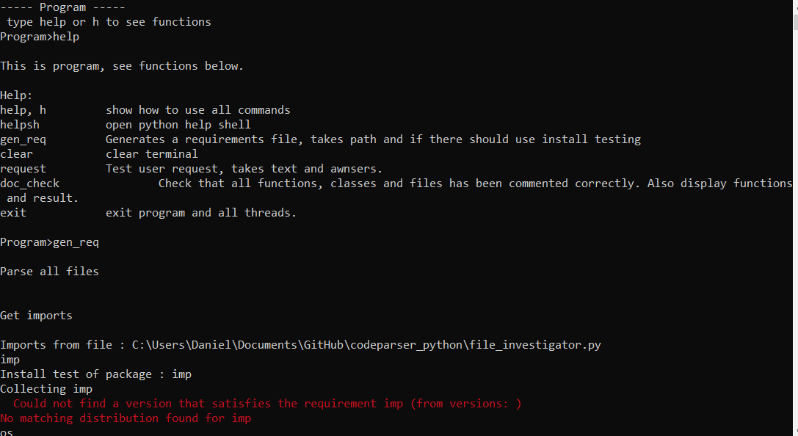

# codeparser_python

Parsing code involves reading each line of code from a file, then split the line and divide the code into tokens.
These tokens can then be filtered to be used in several areas. This repo contains a python3 abstract implementation of a parser using tokenize.generate_tokens.
Several functions have also been added to show how a parser can be used to help in the process of generating requirement files in python, for translating code to different languages and help document code.

# How to run the program?
Since this project contains a requirements-generator, there is a requirement file that can be used to install needed libraries.
To install needed python3 libraries with pip run:
```
pip install -r requirements.txt
```
When needed imports are installed the program can be started by running:
```
python3 main.py
```
Use command h or help to get help using the parse controller!

# Parser

This program uses an easy variant of tokens generations where a library reads each line of a file and split each word or symbol after a specific filter.
The resulting list of words and symbols can be used to see patterns in code quality.

# Generate requirements file

This program creates a requirements file for a project. It parse each file and search for imports, then test each import against "pip install", filenames and usage.

# Parser Controller and User Request

This feature is a parse controller that lets the user controll the program and test functionallity.
See screenshot below.


